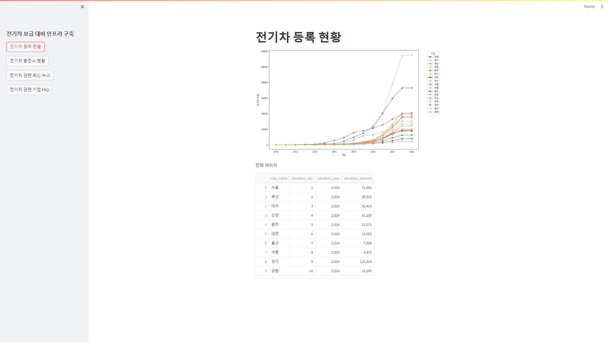
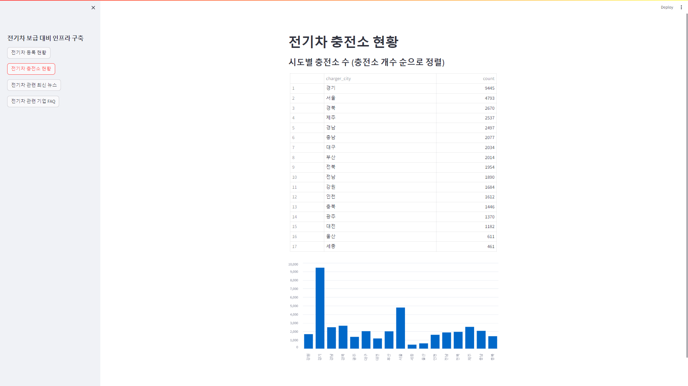
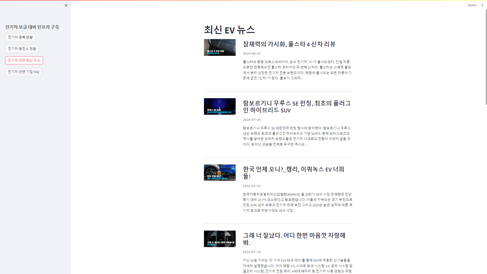
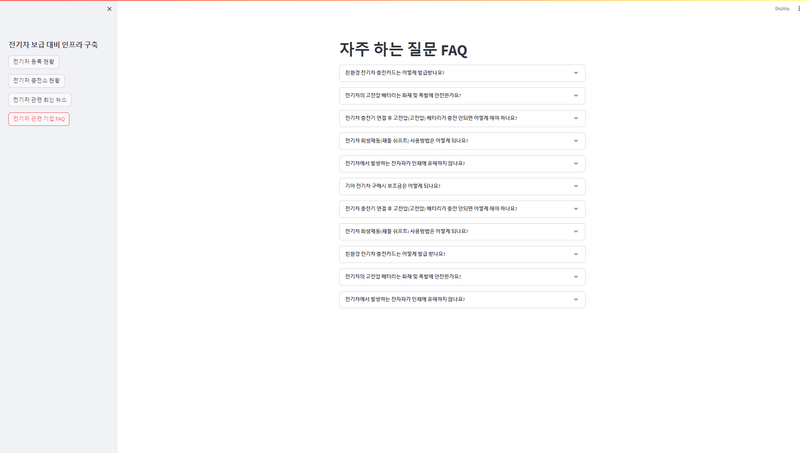

# README

# SKN04-1st-5Team

## 🚗프로젝트 명 : 전기차 등록 현황 및 기업 FAQ 조회시스템
### 2024.08.22 ~ 2024.08.23 팀 프로젝트 <웹 크롤링+스트림릿>

## 💻팀명 : 개발핑

## 👥팀원소개
<p align="center">
	
	
	
	
	
</p>
<div align="center">
	
|   &nbsp;&nbsp; &nbsp; &nbsp; &nbsp;  &nbsp;  &nbsp;  𝐋 이지수  &nbsp;&nbsp; &nbsp;&nbsp; &nbsp;  &nbsp;  &nbsp;    |      &nbsp;&nbsp; &nbsp;&nbsp; &nbsp;  &nbsp;  &nbsp;  𝐒 신원영  &nbsp;&nbsp; &nbsp;&nbsp; &nbsp;  &nbsp;  &nbsp;    |      &nbsp;&nbsp; &nbsp;&nbsp; &nbsp;  &nbsp;  &nbsp;  𝐉 전욱진  &nbsp;&nbsp; &nbsp;&nbsp; &nbsp;  &nbsp;  &nbsp;    |     &nbsp;&nbsp; &nbsp;&nbsp; &nbsp;  &nbsp;  &nbsp;  𝐏 박선필  &nbsp;&nbsp; &nbsp;&nbsp; &nbsp;  &nbsp;  &nbsp;   |     &nbsp;&nbsp; &nbsp;&nbsp; &nbsp;  &nbsp;  &nbsp;  𝐊 김민지  &nbsp;&nbsp; &nbsp;&nbsp; &nbsp;  &nbsp;  &nbsp;   |
|------------------------------------------|--------------------------------------|------------------------------------------|-----------------------------------|-----------------------------------| 
</div>

| 이름     | 역할                                                                                          |
|----------|-----------------------------------------------------------------------------------------------|
| 이지수   | 프로젝트 관리, Git 관리, 전기차 관련 뉴스 크롤링, FAQ 스트림릿 구축, ERD                      |
| 신원영   | 전기차 제조사 기아 FAQ 크롤링, 전기차 관련 뉴스 스트림릿 구축, ERD, README                    |
| 전욱진   | 전기차 충전소 설치 현황 스트림릿 구축, README                                                         |
| 박선필   | 전기차 등록 현황 크롤링, 전기차 등록 현황 스트림릿 구축, README                                       |
| 김민지   | 전기차 충전소 설치 현황 크롤링, 전기차 충전소 설치 현황 스트림릿 구축,README                       |

### 프로젝트 개요

- 한국 정부는 환경 보호와 탄소 배출 저감을 목표로 전기차 구매 보조금, 세금 감면, 충전 인프라 확충 등 전기차 구매 장려 정책을 적극적으로 추진하고 있습니다. 그러나 효과적인 전기차 확산을 위해서는 전기차 관련 이슈와 제조사에서 제공하는 정보, 소비자의 구매 결정에 관여하는 요인을 파악하여 대응하여 합니다.
    
    ‘개발핑’은 정부가 유관 정보들을 빠르게 파악하고 이를 기반으로 전기차 확산 전략을 전개할 수 있도록 [—]를 설계하였습니다. [—]는 전기차 관련 최신 뉴스, 전기차 제조사 FAQ, 지역별 전기차 등록 현황과 충전 인프라 보급 현황을 한눈에 파악할 수 있도록 구성되었습니다. 이를 통해 정책 입안자들이 전기차 산업 동향에 즉각적으로 대응하고 데이터를 기반으로 충전 인프라 시설 확장 계획을 수립하는 데 기여하여 한국의 전기차 전환을 가속화하고자 합니다.
    

### 목표

- **전국 자동차 현황을 크롤링 하여 조회**
    - 전기차에 초점을 맞추어 데이터를 수집하고, 이를 통해 전국의 전기차 보급 현황을 파악
- **수집된 데이터를 정제하여 정보를 제공**
    - **FAQ 조회** : 주제에 맞춰 전기차와 관련된 FAQ를 크롤링하여 시각화
    - **전국 전기차 충전소 현황 조회** : 전기차 충전소 현황을 크롤링 하여 수치를 시각화
    - **전기차 관련 뉴스 조회** : 전기차 관련 뉴스를 크롤링하여 시각화

### 기술스택
<table>
  <tr>
    <td align="center">
      <a href="https://aws.amazon.com" target="_blank" rel="noreferrer">
        <br/>
        AWS
      </a>
    </td>
    <td align="center">
      <a href="https://git-scm.com/" target="_blank" rel="noreferrer">
        <br/>
        Git
      </a>
    </td>
    <td align="center">
      <a href="https://www.postgresql.org" target="_blank" rel="noreferrer">
        <br/>
        PostgreSQL
      </a>
    </td>
    <td align="center">
      <a href="https://www.python.org" target="_blank" rel="noreferrer">
        <br/>
        Python
      </a>
    </td>
    <td align="center">
      <a href="https://www.selenium.dev" target="_blank" rel="noreferrer">
        <br/>
        Selenium
      </a>
    </td>
    <td align="center">
      <a href="https://streamlit.io" target="_blank" rel="noreferrer">
        <br/>
        Streamlit
      </a>
    </td>
  </tr>
  <tr>
    <td align="center">
      <a href="https://www.crummy.com/software/BeautifulSoup/" target="_blank" rel="noreferrer">
        <br/>
        BeautifulSoup
      </a>
    </td>
    <td align="center">
      <a href="https://www.sqlalchemy.org/" target="_blank" rel="noreferrer">
        <br/>
        SQLAlchemy
      </a>
    </td>
    <td align="center">
      <a href="https://pandas.pydata.org/" target="_blank" rel="noreferrer">
        <br/>
        Pandas
      </a>
    </td>
  </tr>
</table>

- **기술 선택과 이유**
프로젝트의 각 기술 스택은 다음과 같은 이유로 선택되었습니다:
    - **Git** : 버전 관리와 협업을 원활하게 하기 위해 사용.
    - **PostgreSQL** : 대규모 데이터 처리를 위한 안정적이고 강력한 관계형 데이터베이스
    - **Python** : 풍부한 라이브러리와 강력한 데이터 처리 능력을 바탕으로 선택
    - **Selenium** : 동적 웹 페이지에서 스크래핑하기 위해 사용
    - **Streamlit**: 수집된 데이터를 외부열람이 가능하도록 시각화 및 서비스 구현에 활용
    - **BeautifulSoup**: 스크래핑으로 수집한 XML 데이터를 파싱하고 분석하는 데 활용
    - **SQLAlchemy**: SQL 데이터베이스와의 효율적인 상호작용을 위해 사용
    - **Pandas**: 수집한 데이터를 분석, 가공하는 데 활용
    - **AWS** :  FREE 티어로 postgres RDS를 사용이 가능하여 선택

## ERD


## 사전 요구사항

```bash
# 다음 내용이 실행 사전에 설치 되어야 합니다.
pip install psycopg2
pip install requests
pip install pandas
pip install sqlalchemy
pip install beautifulsoup4
pip install selenium
pip install webdriver-manager
pip install tqdm
pip install streamlit
```

## 실행

- main.py를 실행하여 구동
    
    ```python
    streamlit run main.py
    ```
    
- 

## 결과

- 전기차 등록 현황 페이지
    
    
    
- 전기차 충전소 현황 페이지
    
    
    
- 최신 전기차 뉴스 현황 페이지
    
    
    
- 전기차 관련 기업 FAQ 페이지
    
    
    

---

### 학습한 내용

- Python 언어를 통하여 주어진 과제에 대하여 필요한 함수들과 내장된 모듈을 사용하여 작성
- 작성된 내용을 다양한 Tool 과 연동하여 데이터베이스를 구축 및 활용
- 사용자를 위한 시각화 작업을 위해 python 프레임워크인 streamlit을 활용하여 시각화 구현
- streamlit을 이용한 시각화 작업을 통해 streamlit 모듈 학습과 데이터 연동을 위한 오류 해결 능력 학습
- postgres 를 이용한 여러개의 테이블을 활용한 데이터 구성 및  관리 능력 학습

### 설계 의도와 방향

1. **프로젝트의 목적**
이 프로젝트는 전기차 관련 정보를 정부 기관에 제공하여 효과적인 확산 정책 수립에 기여하고자 합니다. 정책 입안자가 하나의 통합된 채널에서 유관한 정보를 시각화된 데이터를 통해 빠르게 파악할 수 있도록 전기차 관련 데이터를 수집, 분석, 시각화였습니다.
2. **인터페이스 설계**
정책 입안자가 전기차 보급 장려 정책 입안하는 데 필요할 것으로 예상되는 정보를 직관적이고 쉽게 탐색할 수 있도록 테이블, 그래프 등 데이터 시각화를 통한 간결한 UI를 설계했습니다. 산재된 데이터를 연계하여 한 페이지에서 통합적으로 전기차 관련 정보를 열람할 수 있도록 설계하였습니다. 
3. **데이터 구조와 처리**
PostgreSQL 데이터베이스에 데이터를 저장하고 관리하여, 효율적이고 확장 가능한 데이터 구조를 구축했습니다. 웹 스크래핑과 API를 활용해 데이터를 주기적으로 수집, 갱신하며, SQLAlchemy를 통해 데이터베이스와 Python 간의 원활한 상호작용을 가능하게 했습니다.
4. **프로젝트의 방향성**
정부 정책 입안 과정에서 전기차 구매 희망자와의 이해 관계 구축을 위해 작년도 국내에서 가장 판매량이 높은 전기차 모델 EV6의 제조사 ‘기아’의 FAQ를 수집, 제공하였습니다. 앞으로 국내 완성차 시장에서 전기차 판매 증진을 고려하여 기아 뿐만 아니라 현대, 테슬라 등 더 많은 데이터를 통합하고, 전기차 충전소 현 운영사항, 지역별 불편 사항들을 수집하여 최적화된 정책을 이끌 수 있도록 발전시키고자 합니다. 

### 프로젝트 회고..

| 이지수 | 지금까지 배웠던 과정들을 활용하여 프로젝트를 만들었다는 점이 매우 좋았습니다. 팀장으로써 해야 할 것들에 어떤 것들이 있는 지 알게 해준 좋은 경험을 한 것 같다는 느낌이 들었습니다. |
| --- | --- |
| 신원영 | 프로젝트를 진행하면서 외부 데이터를 가져와 결과물을 도출하는 과정이 생각보다 복잡하고 도전적이라는 것을 느꼈습니다.  |
| 전욱진 | 프로젝트를 참여하면서 지금까지 배웠던 요소 들이 육안으로 확인가능하게 구현하는 과정이 흥미로웠습니다. 개인사정으로 프로젝트의 모든 과정에 함께하지 못한 점이 아쉽고 제 개인 사정에 너른 양해를 주신 팀원 분들께 감사한 시간이었습니다 :) |
| 박선필 | 프로젝트를 진행하면서 아직 많이 부족하다는 것을 알게되는 시간이였던 것 같습니다. 수업때 들었던 내용을 실제로 사용해보면서 오류들을 해결해 나가며 성장할 수 있었던 시간이였던 것 같습니다. |
| 김민지 | 강사님이 알려주신 파이썬 문법과 크롤링 방법들이 실제 프로젝트와 연결되는 것을 볼 수 있었습니다. 앞으로 API를 활용하여 방대한 데이터를 수집하고 가공할 수 있을 것 같아 기대됩니다. 든든한 팀장님과 팀원들 덕분에 잘 진행할 수 있었던 것 같습니다.  |
